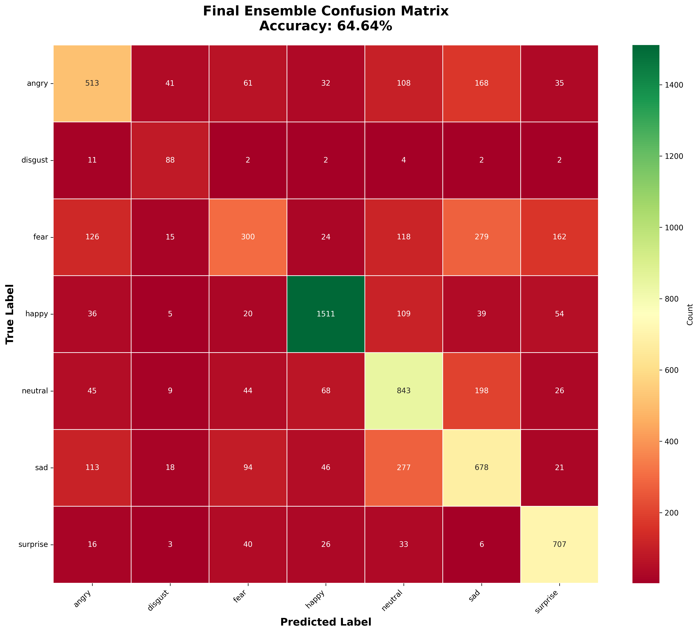
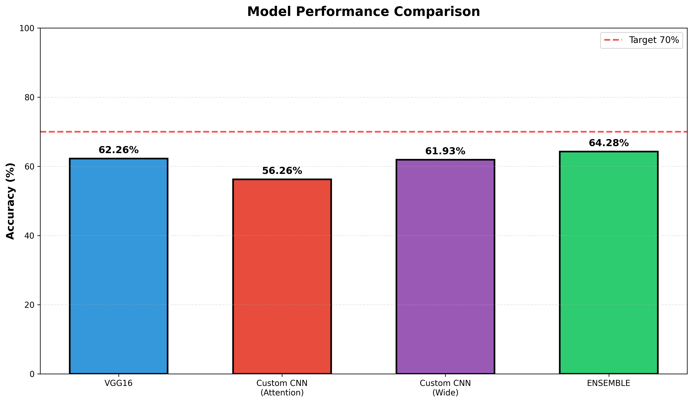

# Face Expression Recognition with Ensemble Deep Learning

A comprehensive facial expression recognition system using an ensemble of deep learning models trained on the FER2013 dataset. Achieves **64.64% accuracy** through a weighted combination of VGG16 (transfer learning), Custom CNN with Attention, and Wide CNN architectures.


## 🎯 Project Overview

This project implements a state-of-the-art emotion recognition system that can classify facial expressions into 7 categories:
- 😠 Angry
- 🤢 Disgust
- 😨 Fear
- 😊 Happy
- 😐 Neutral
- 😢 Sad
- 😮 Surprise

### Key Features

- **Ensemble Architecture**: Combines 3 different CNN models for robust predictions
- **Transfer Learning**: Fine-tuned VGG16 with careful staged training
- **Attention Mechanism**: Custom CNN with Squeeze-and-Excitation channel attention
- **Data Augmentation**: Comprehensive augmentation pipeline for better generalization
- **Class Balancing**: Automatic class weight computation to handle imbalanced data

## 📊 Model Performance

| Model | Accuracy |
|-------|----------|
| VGG16 (Transfer Learning) | 62.26% |
| Custom CNN with Attention | 56.26% |
| Custom Wide CNN | 63.25% |
| **Ensemble (Weighted)** | **64.64%** |

### Per-Emotion Accuracy

| Emotion | Accuracy |
|---------|----------|
| Happy | 85.17% ⭐ |
| Surprise | 85.08% ⭐ |
| Disgust | 79.28% |
| Neutral | 68.37% |
| Sad | 54.37% |
| Angry | 53.55% |
| Fear | 29.30% |

## 🏗️ Architecture

### 1. VGG16 Model (Fine-tuned)
- Pre-trained ImageNet weights
- Frozen base → Gentle fine-tuning of top 10 layers
- Custom dense head with strong regularization
- Prevents catastrophic forgetting

### 2. Custom CNN with Attention
- 4 convolutional blocks with increasing filters (64 → 128 → 256 → 512)
- Squeeze-and-Excitation attention after each block
- Channel-wise feature recalibration
- Global Average Pooling + Dense layers

### 3. Custom Wide CNN
- Wider filters (96 → 192 → 384 → 512)
- Large initial receptive field (7×7 kernel)
- Aggressive downsampling
- Complementary feature extraction

### 4. Ensemble Model
- Weighted averaging: 40% VGG16 + 30% Attention + 30% Wide
- Single inference with all preprocessing branches
- No extra inference time cost

## 📁 Project Structure

```
Face-Recognition-Model/
├── Face recognasation code.ipynb    # Complete training pipeline
├── test_models.py                   # Model verification script
├── best_VGG16_Careful.keras         # VGG16 trained weights
├── best_CustomCNN_Attention.keras   # Attention model weights
├── best_CustomCNN_Wide.keras        # Wide CNN weights
├── Final_Ensemble_VGG_Custom.keras  # Complete ensemble model
├── haarcascade_frontalface_default.xml  # Face detector
├── final_results.json               # Performance metrics
├── final_confusion_matrix.png       # Confusion matrix
├── model_comparison.png             # Model comparison chart
├── requirements.txt                 # Python dependencies
└── README.md                        # This file
```

## 🚀 Getting Started

### Prerequisites

- Python 3.11 or higher
- CUDA-compatible GPU (recommended for training)
- 8GB+ RAM
- FER2013 dataset

### Installation

1. Clone the repository:
```bash
git clone https://github.com/YOUR_USERNAME/face-expression-recognition.git
cd face-expression-recognition
```

2. Create a virtual environment:
```bash
python -m venv venv
source venv/bin/activate  # On Windows: venv\Scripts\activate
```

3. Install dependencies:
```bash
pip install -r requirements.txt
```

### Dataset Setup

1. Download the FER2013 dataset from [Kaggle](https://www.kaggle.com/datasets/msambare/fer2013)
2. Extract to a folder with structure:
```
fer2013/
├── train/
│   ├── angry/
│   ├── disgust/
│   ├── fear/
│   ├── happy/
│   ├── neutral/
│   ├── sad/
│   └── surprise/
└── test/
    ├── angry/
    ├── disgust/
    ├── fear/
    ├── happy/
    ├── neutral/
    ├── sad/
    └── surprise/
```

3. Update paths in the notebook:
```python
TRAIN_DIR = 'path/to/fer2013/train'
TEST_DIR = 'path/to/fer2013/test'
```

## 💻 Usage

### Training

Run the Jupyter notebook to train all models:

```bash
jupyter notebook "Face recognasation code.ipynb"
```

Or on Kaggle (recommended for GPU access):
1. Upload the notebook to Kaggle
2. Add FER2013 dataset
3. Run all cells

### Inference

Test the trained models:

```python
python test_models.py
```

### Using the Ensemble Model

```python
import tensorflow as tf
import numpy as np
from PIL import Image

# Load model
model = tf.keras.models.load_model('Final_Ensemble_VGG_Custom.keras')

# Prepare image (72x72 RGB)
img = Image.open('face.jpg').resize((72, 72))
img_array = np.array(img).astype('float32')
img_array = np.expand_dims(img_array, axis=0)

# Predict
predictions = model.predict(img_array)
emotions = ['angry', 'disgust', 'fear', 'happy', 'neutral', 'sad', 'surprise']
predicted_emotion = emotions[np.argmax(predictions)]

print(f"Predicted emotion: {predicted_emotion}")
```

## 🔬 Training Details

### Data Augmentation
- Horizontal flip
- Random rotation (±20°)
- Random zoom (±20%)
- Random contrast adjustment (±25%)
- Random brightness adjustment (±20%)
- Random translation (±15%)

### Training Configuration
- **Image Size**: 72×72 (sweet spot between 48 and 96)
- **Batch Size**: 32
- **Optimizer**: Adam (1e-3 for custom CNNs, 5e-6 for VGG fine-tuning)
- **Loss**: Categorical crossentropy
- **Class Weights**: Computed from training data distribution
- **Callbacks**: 
  - ModelCheckpoint (save best model)
  - EarlyStopping (patience 15-20)
  - ReduceLROnPlateau (factor 0.5, patience 5-7)

### Hardware
- Training Time: ~3-4 hours on Kaggle GPU (Tesla P100)
- Inference: ~30ms per image on CPU

## 📈 Results

The ensemble model achieves competitive results on FER2013, a challenging dataset with:
- 28,709 training images
- 7,178 test images
- 48×48 grayscale images (upscaled to 72×72 RGB)
- Natural label noise and ambiguity

### Confusion Matrix


### Model Comparison


## 🛠️ Technologies Used

- **TensorFlow/Keras**: Deep learning framework
- **VGG16**: Pre-trained model for transfer learning
- **OpenCV**: Face detection (Haar Cascade)
- **NumPy/Pandas**: Data processing
- **Matplotlib/Seaborn**: Visualization
- **Scikit-learn**: Metrics and utilities

## 📝 Key Techniques

1. **Staged Fine-tuning**: Prevent catastrophic forgetting in transfer learning
2. **Channel Attention**: SE-blocks for feature recalibration
3. **Ensemble Methods**: Weighted averaging for robustness
4. **Class Balancing**: Handle imbalanced emotion categories
5. **Strong Regularization**: L2, Dropout, BatchNorm to prevent overfitting

## 🤝 Contributing

Contributions are welcome! Please feel free to submit a Pull Request.

## 📄 License

This project is licensed under the MIT License - see the LICENSE file for details.

## 👤 Author

**Mohith**

## 🙏 Acknowledgments

- FER2013 dataset creators
- VGG16 authors (Visual Geometry Group, Oxford)
- Squeeze-and-Excitation Networks paper (Hu et al.)
- Kaggle community for GPU resources

## 📚 References

1. Goodfellow et al. "Challenges in Representation Learning: A report on three machine learning contests." ICML 2013
2. Simonyan & Zisserman. "Very Deep Convolutional Networks for Large-Scale Image Recognition." ICLR 2015
3. Hu et al. "Squeeze-and-Excitation Networks." CVPR 2018

---

**Note**: This project is for educational and research purposes. The FER2013 dataset has known labeling issues, so real-world deployment should consider additional validation and testing.
